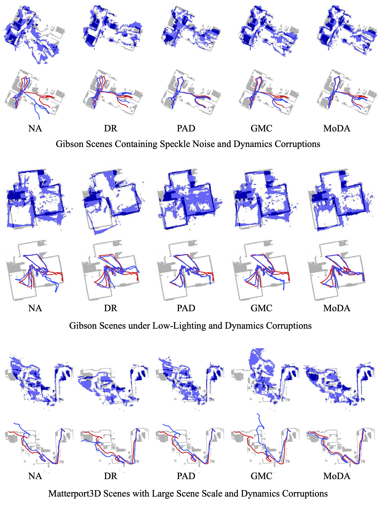

<!DOCTYPE html>
<html>
  <head>
    <meta charset="utf-8" />
    <meta name="viewport" content="width=device-width, initial-scale=1" />
    <title>Multi-agent Exploration with Similarity Score Map and Topological Memory</title>
  

    <!-- Google Fonts -->
    <link rel="preconnect" href="https://fonts.googleapis.com" />
    <link rel="preconnect" href="https://fonts.gstatic.com" crossorigin />
    <link
      href="https://fonts.googleapis.com/css2?family=Encode+Sans:wght@300;400;500;600&family=Roboto+Mono&display=swap"
      rel="stylesheet"
    />

    <!-- Bulma -->
    <link rel="stylesheet" href="https://cdn.jsdelivr.net/npm/bulma@0.9.4/css/bulma.min.css" />
    <link rel="stylesheet" href="./css/styles.css" />
    

    <!-- Font Awesome -->
    

    <!-- Academicons -->
    <link rel="stylesheet" href="https://cdn.jsdelivr.net/gh/jpswalsh/academicons@1/css/academicons.min.css" />
  </head>

  <body>
    <!-- logo img -->
    <nav class="navbar logo">
      

        
      

    </nav>

    <!-- title / authors / icons -->
    <section class="hero">
      

        

          <!-- title -->
          <h1 class="title is-size-1 is-size-2-mobile publication-title">
            Multi-agent Exploration with  Similarity Score Map and Topological Memory
          </h1>

          <!-- authors -->
          

            

              

                <a class="author-blocks" href="https://eunsunlee.github.io">Eun Sun Lee</a>
              

              

                <a class="author-blocks" href="http://3d.snu.ac.kr/members">Young Min Kim</a>
              

            

          

          

            Dept. of Electrical and Computer Engineering, Seoul National University
          

          <!-- icons -->
          

            <a class="button link-button is-rounded" href="./assets/paper.pdf">
              
                <i class="fa-solid fa-file"></i>
              
              Paper
            </a>
            <a class="button link-button is-rounded" href="https://www.youtube.com/watch?v=j7u47WUZESI">
              
                <i class="fa-brands fa-youtube"></i>
              
              Video
            </a>
            </a>
            <a class="button link-button is-rounded" href="https://github.com/eunsunlee/SimilarityScoreMap">
              
                <i class="fab fa-github"></i>
              
              Code
            </a>
          

        

      

    </section>

    <!-- teasor -->
    <section class="hero">
      

        

          
          <h2 class="subtitle has-text-centered">
            we present a multi-agent exploration strategy that coordinates the actions of multiple robots 
            within a shared environment to optimize overall exploration coverage. 
            Our approach combines the classical frontier-based method with a novel similarity score map derived from topological graph memory.
            
          </h2>
        

      

    </section>

    <!-- content section with left-side subtitle, which is aligned to center -->
    <section class="section">
      

        <!-- abstract -->
        

          

            <h2 class="subtitle is-4 is-size-3-mobile has-text-weight-medium publication-keywords">Abstract</h2>
          

          

            

              Multi-robot exploration can be a collaborative solution for navigating a large-scale area. 
              However, it is not trivial to optimally assign tasks among agents because the state dynamically changes while the local observations of multiple agents concurrently update the global map. 
              Furthermore, the individual robots may not have access to accurate relative poses of others or global layouts. 
              We propose an efficient spatial abstraction for multi-agent exploration based on topological graph memories. 
              Each agent creates a topological graph, a lightweight spatial representation whose nodes contain minimal image features. 
              The information in graphs is aggregated to compare individual nodes and is used to update the similarity scores in real-time. 
              Then, the agents effectively fulfill distributed task goals by examining the dynamic similarity scores of frontier nodes. 
              We further exploit extracted visual features to refine the relative poses among topological graphs. 
              Our proposed pipeline can efficiently explore large-scale areas among various scene and robot configurations without sharing precise geometric information.
            

          

        

        <!-- video -->
        

          

            <h2 class="subtitle is-4 is-size-3-mobile has-text-weight-medium publication-keywords">Video</h2>
          

          

            

              <iframe
                src="https://www.youtube.com/embed/j7u47WUZESI?si=x0xlB16kK1TOXN_I"
                allow="autoplay; encrypted-media"
                allowfullscreen="true"
              ></iframe>
            

          

        

      

    </section>

    <!-- Content section with left-side subtitle -->
    <section class="section">
      

        

          

            <h2 class="subtitle is-4 is-size-3-mobile has-text-weight-medium publication-keywords">Navigation Pipeline</h2>
          

          

            
            

              At each time step, the agent traverses the scene and collects an RGBD observation and odometry sensor measurement as input. The agent also creates a node of a topological graph. 
              Each node contains the RGBD observation, and the edge stores the relative pose between nodes, initialized by the odometry reading.
              Our proposed graph structure is designed to share essential information across different agents in real-time. 
              Next, in the global goal planner, agents share topological graphs, which are then used to generate a similarity score map and also to help optimize the relative positions of deployed agents. 
              Utilizing the collective graph information, the global goal planner offers high-level direction to the agents by assigning a long-term objective.
              Subsequently, the local planner generates the specific next-step actions needed to achieve the assigned global goal.

            

          

        

      

    </section>

    <!-- Content section with left-side subtitle -->
    <section class="section">
      

        

          

            <h2 class="subtitle is-4 is-size-3-mobile has-text-weight-medium publication-keywords">Global Goal Planner</h2>
          

          

            
            

              Our global planner estimates the frequency of agents’ visits within the mapped area.
              First, individual agents mark similarity scores for their observation nodes and generate score graph.
              To achieve the score graph, each node is passed through a pretrained encoder to extract similarity features. 
              The inner product of these feature vectors is used to calculate a similarity score matrix. 
              The summed scores for each node are then updated on the topological graph, resulting in a scored graph.
              From the score graph, two layers of maps are generated, the frontier map and the similarity score map. 
              Lastly, the frontier with the lowest similarity score is selected as the final global goal.
            

          

        

      

    </section>

    <!-- content section with left-side subtitle -->
    <section class="section">
      

        

          

            <h2 class="subtitle is-4 is-size-3-mobile has-text-weight-medium publication-keywords">
              Demo Video
            </h2>
          

          

            <video controls="controls" width="800" height="600" name="Video Name">
              <source src="./assets/shortmovie.mp4">
            </video>
            

              This video shows a demo of multi-agent exploration performance evaluated in the Habitat Simulator. 
              Our suggested policy is compared with state-of-the-art approaches on a scene samples from the Matterport3D dataset. 
              The reconstructed maps (gray) and each of the five agents' trajectories are visualized with different colors.
            

          

        

      

    </section>

    <!-- Content section with left-side subtitle
    <section class="section">
      

        

          

            <h2 class="subtitle is-4 is-size-3-mobile has-text-weight-medium publication-keywords">
              Experiment Result
            </h2>
          

          

            
            

              Qualitative result of mapping (top) and localization (bottom) obtained from agents observing the 
              identical sequence of RGB observations and odometry sensor readings. 
              The reconstructed maps (blue) are aligned on the ground-truth maps (grey), 
              and the estimated pose trajectories (blue line) are compared to the ground-truth trajectories (red line).
            

          

        

      

    </section> -->

    <!-- BibTex sectoion -->
    <section class="section">
      

        

          <h2 class="subtitle is-size-3 has-text-weight-medium publication-keywords">BibTeX</h2>
        

        

          <!-- <pre>

@inproceedings{lee2022moda,
  title={MoDA: Map style transfer for self-supervised Domain Adaptation of embodied agents},
  author={Lee, Eun Sun and Kim, Junho and Park, SangWon and Kim, Young Min},
  booktitle={European Conference on Computer Vision},
  pages={338--354},
  year={2022},
  organization={Springer}
}</pre -->
          >
        

      

    </section>

    <!-- Footer section -->
    <footer class="footer" style="padding-top: 1rem">
      <!-- navigation -->
      <a role="button" class="navbar-burger" data-target="moreResearch" aria-label="menu" aria-expanded="false">
        
        
        
      </a>
      

        

          

            <a class="navbar-item" href="https://sites.google.com/view/eunsunlee">
              
                <i class="fas fa-home"></i>
              
            </a>
            <a class="navbar-item" href="https://github.com/eunsunlee">
              
                <i class="fab fa-github"></i>
              
            </a>
          

        

      

      <!-- license -->
      

        

          This website is licensed under a
          <a rel="license" href="http://creativecommons.org/licenses/by-sa/4.0/"
            >Creative Commons Attribution-ShareAlike 4.0 International License</a
          >
        

      

    </footer>
  </body>
</html>
